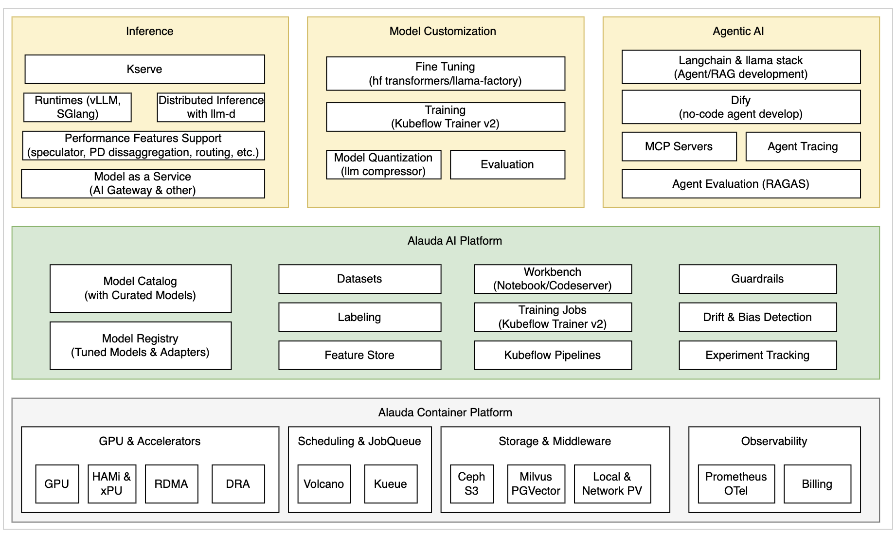

The diagram below illustrates the architecture of the Alauda AI platform.



NOTE: Alauda AI uses some general Kubernetes, ACP components including:

* ALB
* Erebus
* kube-apiserver (kubernetes component)

| Component | Description | Type | License |
| --- | --- | --- | --- |
| Lich | Alauda AI UI console | Self-developed |     |
| aml-operator | Manages installation and life cycles of Alauda AI components | Self-developed |     |
| aml-apiserver | Extends kubernetes api-server and provide authorization enhancements for Alauda AI API access | Self-developed |     |
| skipper & oauth2-proxy | Proxies traffic from the global cluster to workload clusters. Traffic is authenticated by oauth2-proxy | Open source | Apache Version 2.0 |
| aml-controller | Manages Alauda AI namespaces on workload clusters. Namespaces will be automatically configured a Model Repo space and corresponding resources. | Self-developed |     |
| aml-api-deploy | Provides high-level APIs for "Lich" | Self-developed |     |
| Gitlab (with Minio or S3) | Model repository backend storage and version tracking. | Open source | MIT |
| kserve-controller | (Optionally with knative serving enabled) Manages AI inference services and inference service runtimes. | Open source | Apache Version 2.0 |
| workspace-controller | Manages workbench instances (jupyter notebooks, codeserver) | Open source | Apache Version 2.0 |
| Volcano | Plugin to provide co-scheduling (gang-scheduling) features for AI training jobs. Also manages "volcanojob" resource to run general training workloads. | Open source | Apache Version 2.0 |
| MLFlow | Track training, evaluation jobs by storing, visualizing metrics and artifacts | Open source | Apache Version 2.0 |
| Fine Tuning | Experimental UI providing no-code LLM fine tunning job creation and management | Self-developed |     |
| Kubeflow | Open source plugin providing MLOps features including: Notebooks, Tensorboard, Kubeflow pipeline, training operator. | Open source | Apache Version 2.0 |
| Label Studio | Open source plugin for dataset labeling | Open source | Apache Version 2.0 |
| Dify | Open source plugin for creating LLM Agents, RAG applications using a web UI | Open source | ```<br>a modified version of the Apache License 2.0<br>``` |
| Evidently | Open source plugin for monitoring online inference service performance and data drifts | Open source | Apache Version 2.0 |
| GPU device plugins | HAMi and nvidia gpu device plugin | Open source | Apache Version 2.0 |
